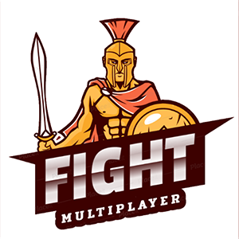
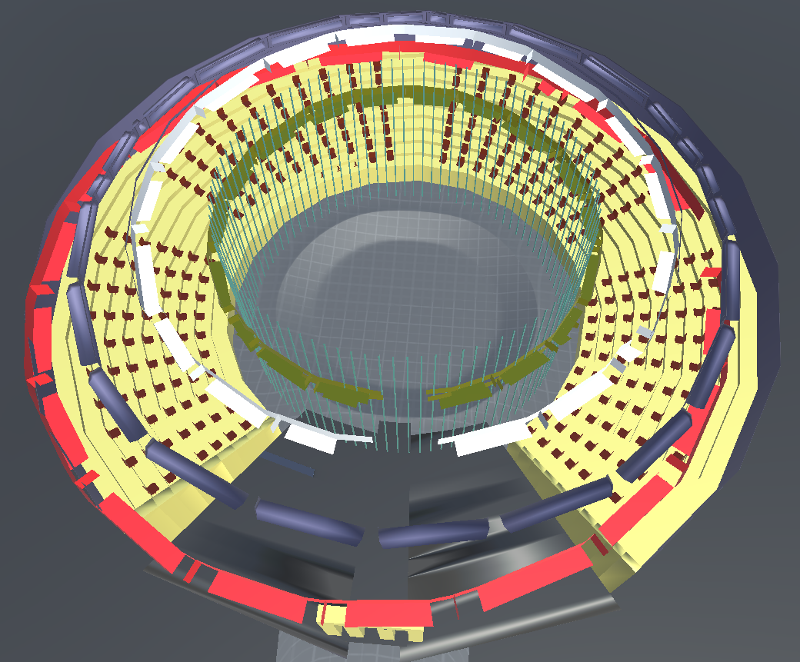
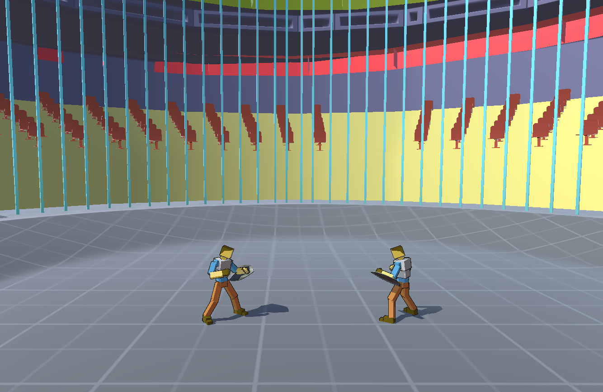
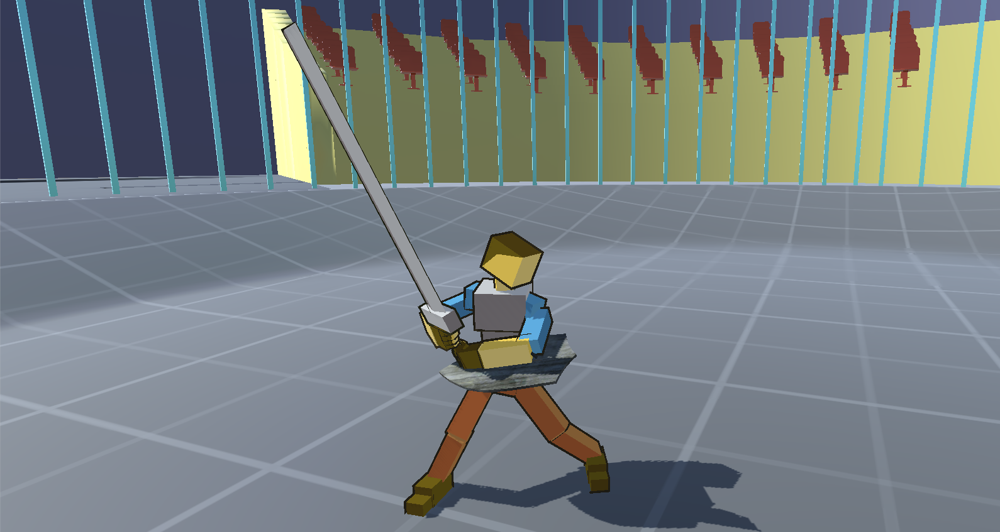
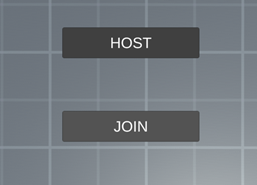
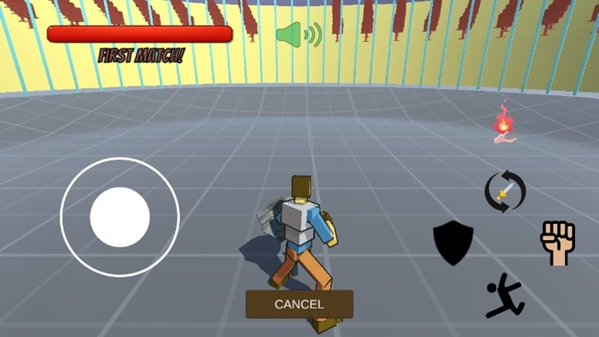
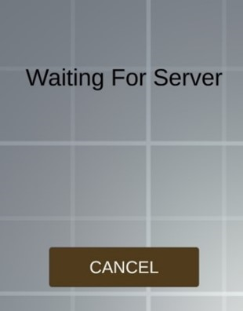
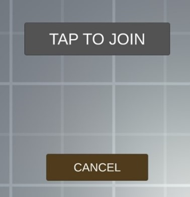
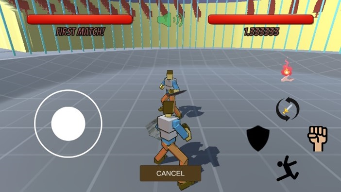

# FIGHT!

  

# Introduction
The game Fight is a 3d multiplayer game. This game is built upon the Unity3d game engine. The objective of this game is to fight the opponent and win.  
**App Link Android**: [https://drive.google.com/file/d/1o6oKv7AC4TTkxTvRxYuknuteEUVRiXjj/view?usp=sharing](https://drive.google.com/file/d/1o6oKv7AC4TTkxTvRxYuknuteEUVRiXjj/view?usp=sharing)  
**App Link Windows**: [https://drive.google.com/file/d/148Ig8l-EgBYXaxaMr7MRjwNoB6adUope/view?usp=sharing](https://drive.google.com/file/d/148Ig8l-EgBYXaxaMr7MRjwNoB6adUope/view?usp=sharing)

# Platforms: Android, Windows
The currently supported platforms for this game are both Android and Windows. Cross play between Android and Windows is also available.

# Game Overview
Fight is a 3d, third person, multiplayer, one vs one fighting game. In this game one can only fight another real player and not AI. Players connects via Wi-Fi hotspot and then fight each other to death!

# Game Description
The main focus of this game is the Multiplayer system so that player can fight another real player (most likely friend!) and not an unsmart AI. The fight happens in an enclosed arena. After a math finishes the defeated player can request a rematch to the other player. Here are some key components of the game-
- **Multiplayer**: We have used the built in UNet library to achieve the multiplayer functionality. There are some other networking libraries like photon, bolt etc. But we decided to go with the Unet because it has the most resource.
- **Arena**:  
  
-	**Character**:  

-	**Animations**: The character is fully animated for all kinds of situation. Animations make a game feels more alive and dynamic.

# Game Features
The game features a variety of things. Here are some of the most noticeable features-
-	**Hotspot multiplayer**: After connecting two devices via Wi-Fi hotspot, players can fight each other in real time.
-	**Health bar**: Each player has its own health, after the health reaches to 0, the player loses.
-	**Ratio**: The number of wins and loses so far are shown on the home screen. The ratio between wins and loses is shown during the fight under the Health Bar.
-	**Movement**: Player can move around freely in any direction. But the looking direction is restricted due to multiplayer complexity. During a fight player will always look at the opponent.
-	**Jump**: Player can jump in any direction.
-	**Shield**: Player can protect themselves with a wooden shield.
-	**Weapons**: Player can decide whether use fist or sword to attack the opponent.
-	**Magic spell**: A powerful magic spell attack fireball can be casted which deals heavy damage to the opponent. But there is a certain amount of time is need for the player to cast the magic spell again.
-	**Sounds**: There are all kinds of sounds present in the game. These sounds make the game more natural. Sounds can be switched on or off.
-	**Particle effects**: Particle effects make a game more stunning and appealing to the player. Blood splash, explosion and some other particle effects are present in this game.
-	**Screen shake**: The screen shakes while being attacked by the opponent. It makes the game punchier and alive.
-	**Victory dance**: After winning a fight the victorious player starts dancing.
-	**Cross play**: Android user and windows user can also fight each other by connecting via Wi-Fi hotspot.

# User Manual
## Getting Started
For two players to fight each other, both users must be in the same Wi-Fi network. If there is no Wi-Fi in the area, then any one of the users must turn his device’s hotspot on and let the other user connect to that hotspot. It is required to have a stable connection between the two devices. Now the users can both open the game in their corresponding devices.  
After the game opens, in the home screen there will be two buttons. One is HOST and the other is JOIN.  
Now one user will have to click the HOST button. After clicking the HOST button, the character will appear in an arena.  
   
Now the other user has to click the JOIN button. Then a new button CLICK TO ENTER will appear. CLICK TO ENTER button only appears if the other user has already clicked HOST button and entered into the arena.  
    
After clicking CLICK TO ENTER the other player will also join the arena.
Now both of the players are in the arena and can fight each other.
User can also click the CANCEL button and go back to the home screen.
## Control: 
-	**Android**: The joystick on the left side on screen is used for moving the character up-down, left-right. And the icons on the right side perform the corresponding actions shown by the icons. Shield icon to bring in/out the shield, switch icon to switch the weapon, sword, or fist icon to attack the opponent, jump icon for jumping and magic icon to shoot fireball.
-	**Windows**: WASD is used for moving the character. F for shooting magic fireball, up-arrow for weapon switching, left arrow to bring in/out shield, down arrow for jumping and right arrow is for attacking.

